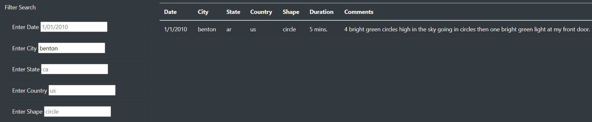
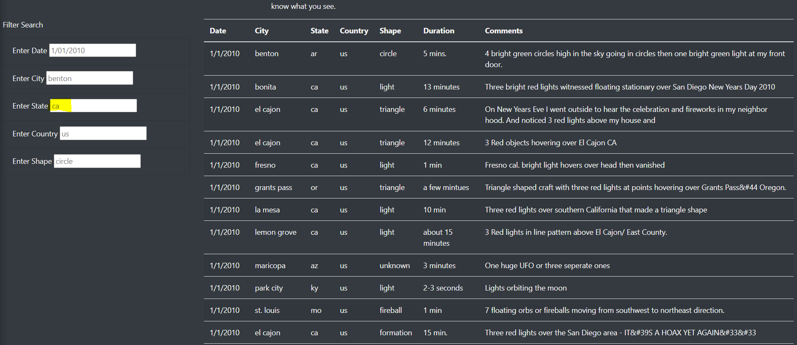
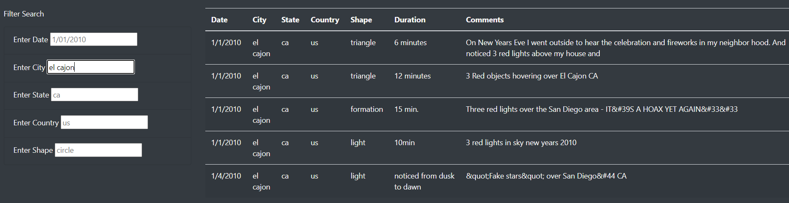

# UFOs

## Overview of Project:
- To create a responsive JavaScript web app that can filter large data based on date, location (city, state, country), or land shape. With this app you can search for specific UFO sightings that occurred in certain places or cities, and quiickly gather data on all events.

## Results:
- User guide: Welcome to the UFO sighting web app! Basic steps to help navigate: Find UFO sighting info that reveals date, city, state, country, shape, duration, and description of the event. All events except duration and description can be filtered to display specific results. Placeholder values show recommend format of search terms.

- Adding multiple filters => filtering within filters: more than 1 search field can be used at once, but take note that the order the filters are entered matters. Be careful not to constrict the scope of your query too soon (ie. searching city before searching state) to get all desired search results. As shown below, searching for results in 'ca' reveals over 30 results, whereas further filtering to city to 'el cajon' returns only 5 results

* Searching for ca sightings

* Searching for el cajon sightings

## Summary of drawbacks and recommendations for this implementation:
- Drawback: This version does not have a reset feature that can refresh the app after applying too specific filters. Presently, users must refresh(ctrl+r) to reset the filters
- Recommendation 1: Implement refresh feature as a reset button that can reset all filters. For this app, we can simply refresh the page not worrying about load times for this small dataset
- Recommendation 2: Display total number of search results and add feature to export results as csv
